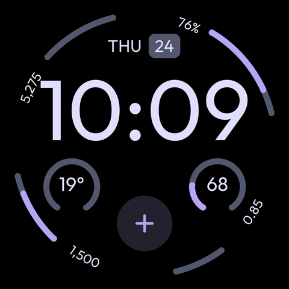
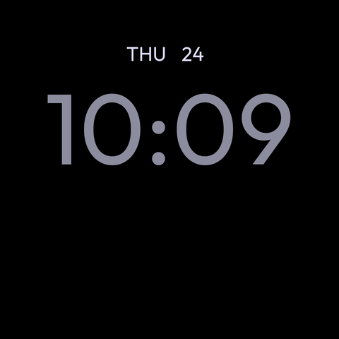

# Modular Lab · Pixel Watch

A reproducible, independently written recreation of the **Pixel Watch 4 Modular** layout using Google's **Watch Face Format (WFF)**. It has a large digital clock, date pill, four curved edge complications, two circular complications and a bottom shortcut. All seven slots are editable; three palettes and a sparse always-on mode are included.

 

These are generated layout previews with **sample data**, not watch screenshots. [Open the preview](docs/preview.html) locally to compare palettes, ambient mode and first-install appearance.

## Quick start on this Windows PC

Java 17, Python 3.11, Android platform 36, Build Tools 36.0.0 and ADB were already installed when this project was created.

```powershell
# From the repository root: builds a signed, installable debug APK offline.
python tools/build_apk.py

# Check WFF syntax. First run downloads Google's checksum-pinned validator.
python tools/validate.py
```

APK: **`build/fast/modular-lab-debug.apk`**. This resource-only build uses the SDK's official AAPT2, zipalign and apksigner directly. There are no Python packages or Gradle downloads needed for this path. The resulting APK uses the same package ID and local debug key as the Gradle build.

## Test on your Pixel Watch 4

1. Connect the PC and watch to the same Wi-Fi network.
2. On the watch, open **Settings → System → About → Versions** and tap **Build number** seven times to enable Developer options. Menu wording can vary with the OS version.
3. Open **Settings → Developer options**, enable **ADB debugging**, then **Wireless debugging**. Allow the network when prompted.
4. Under Wireless debugging, tap **Pair new device**. Run the following with the IP and **pairing port** shown there; enter the watch's pairing code when prompted:

   ```powershell
   adb pair 192.168.1.42:37001
   ```

5. Return to the main Wireless debugging page. Use its **connection port**, usually different from the pairing port:

   ```powershell
   adb connect 192.168.1.42:42001
   adb devices -l
   python tools/build_apk.py --install --serial 192.168.1.42:42001
   ```

   The addresses above are examples; replace both ports with those on your watch. Pair once; reconnect if the connection port changes.

6. Long-press the current face on the watch, choose **Add watch face**, find **Modular Lab**, and select it. Long-press → **Edit** to set the palette and complication providers. The face has no launcher activity, so it will not appear as a normal app.

For subsequent edits, repeat only the build/install command. `install -r` updates the existing package and normally preserves the selected providers. If the display has not refreshed, switch to another face and back. Turn wireless debugging off when finished to reduce battery drain.

The scripts refuse to install on a target that does not identify itself as a watch. If more than one device is connected, use `--serial` explicitly.

## Test in a real Wear OS emulator

The local HTML preview is useful for layout, but Android's Wear OS emulator is needed to check actual rendering and editing.

1. Install [Android Studio](https://developer.android.com/studio) and open this repository.
2. In **SDK Manager**, install Android SDK Platform **36**, Build Tools **36.0.0**, Platform Tools and **Android Emulator**. Use **JDK 17 or newer** (Android Studio's compatible bundled JDK is also suitable).
3. In **Device Manager → Create Virtual Device**, choose a **Wear OS round** hardware profile. Download a **Wear OS 6 / Android 16 / API 36** image to match the Pixel Watch 4's launch OS. A newer Wear OS image also works. Use the image matching your computer architecture, and enable hardware virtualization if prompted. Do not select a phone image.
4. Start the emulator and complete its welcome/setup screens. A phone pairing is not needed to sideload this standalone face.
5. Install and select the face:

   ```powershell
   adb devices -l
   python tools/build_apk.py --install --serial emulator-5554
   ```

   Replace the serial if ADB shows a different one. Long-press the emulator's face → **Add watch face → Modular Lab**.

6. Test **Edit**, the three palettes, 12/24-hour time (system settings), all complication tap targets and always-on display. Enable Always-on screen in the emulator's Display settings and let it enter ambient mode. Repeat on both small and large round profiles for the two watch sizes.

**Android Studio Run:** if your Studio build offers a Wear OS Watch Face run configuration, select the `watchface` module and target. Otherwise use the commands above; a normal Android App configuration trying to launch a default Activity is inappropriate for this resource-only package.

Weather, Fitbit and third-party complication providers may be absent on emulator images. That is expected: configure an available provider, or test those slots on the physical watch. Emulator results do not establish real battery life or Fitbit behavior.

## Customize the face

The editable design source is [`tools/generate_face.py`](tools/generate_face.py). It generates the repeated complication markup into [`watchface/src/main/res/raw/watchface.xml`](watchface/src/main/res/raw/watchface.xml). Edit the generator, then run:

```powershell
python tools/generate_face.py
python tools/validate.py
python tools/build_apk.py --install --serial YOUR_DEVICE_SERIAL
```

The canvas is 480 × 480 design units; Wear OS scales it to the actual display. Geometry, colors and text sizes are in the generator. The clock follows the watch's 12/24-hour preference. Date and time use live system data. The watch face itself requests no sensor or location permissions; complications come from the providers you select, which may require their own permissions.

| Slot | Position | Initial provider | Suggested Modular-style choice |
|---|---|---|---|
| 1 | Upper-left edge | System steps | Fitbit steps |
| 2 | Upper-right edge | Watch battery | Floors, if offered by an installed provider |
| 3 | Lower-left edge | Empty, labeled KCAL | Calories |
| 4 | Lower-right edge | Empty, labeled DIST | Distance |
| 5 | Left circle | Empty, labeled WEATHER | Weather temperature |
| 6 | Right circle | Empty, labeled PULSE | Heart rate |
| 7 | Bottom circle | Empty, plus icon | App shortcut / supported image complication |

Slot labels describe the intended layout, not a restriction on the provider. Only providers supporting the slot's data types appear in the system picker. Numeric slots support short text, ranged values and WFF 2 goal progress. Circles also support monochromatic images; the bottom slot supports small images, monochromatic images and short text. Empty health slots show placeholders, never fabricated live readings. A short-text provider has no numeric range, so its arc is decorative; progress arcs move only for ranged/goal data. The bottom plus is an empty-slot marker: configure it through **Edit**, after which the provider supplies its tap action.

Always-on mode intentionally displays only the time and date, with dimmer time and no filled date pill. It contains no seconds animation or complication refresh animation.

### Regenerate the images / instant layout preview

Only image generation needs Pillow. The APK build does not.

```powershell
python -m pip install -r requirements-dev.txt
python tools/render_preview.py
Start-Process .\docs\preview.html
```

Or run `powershell -ExecutionPolicy Bypass -File tools/dev.ps1 Preview` to regenerate both XML and images and open the viewer. The preview renderer reads the WFF geometry and palettes but implements only this project's subset. Text baselines and arcs are approximate, provider icons are omitted from fixtures, and there is no touch/sensor/runtime simulation. Confirm the final appearance on Wear OS.

The font, original plus icon, picker preview and documentation images are stored in Git. The generator, fixture data and pinned Pillow version are stored alongside them. Font provenance and licenses are in [THIRD_PARTY_NOTICES.md](THIRD_PARTY_NOTICES.md).

### Capture the actual result

```powershell
python tools/capture.py --serial YOUR_DEVICE_SERIAL
```

This writes a PNG to ignored `captures/`. Copy a chosen capture into `docs/images/` when you want to commit it. The Python helper preserves binary output on Windows PowerShell 5, where redirecting `adb exec-out ... > file.png` can corrupt PNGs.

## Standard Gradle build and GitHub automation

Pinned toolchain: **Gradle 9.3.1**, **Android Gradle Plugin 9.0.0**, **compile/target SDK 36**, **Build Tools 36.0.0**, **WFF 2**, **minimum API 34 / Wear OS 5**. WFF 2 provides the goal-progress complication type while remaining compatible with Pixel Watch 4. A Compose/Flutter app or legacy watch-face service is unnecessary for this declarative face.

```powershell
.\gradlew.bat :watchface:assembleDebug :watchface:lintDebug
# Output: watchface/build/outputs/apk/debug/watchface-debug.apk
```

On macOS/Linux use `./gradlew`. Set `ANDROID_HOME`, or let Android Studio write the ignored `local.properties`. The wrapper verifies its Gradle distribution SHA-256. The first Gradle build needs internet access to Google's Maven repository and Maven Central. If those downloads time out, use the SDK-only build above.

GitHub Actions validates the WFF, checks that generated files are current, runs Android lint, builds APKs and attaches them to the workflow run. Open this repository's **Actions → Build watch face → successful run → Artifacts** to download them. Debug APKs are for sideloading; Play Store publishing and release signing are outside this starter.

Debug signing keys stay on the build machine and are not committed. A GitHub-built APK may have a different certificate from your locally built one. If Android reports `INSTALL_FAILED_UPDATE_INCOMPATIBLE`, use the same build machine/key, or deliberately uninstall **only Modular Lab** (`adb -s SERIAL uninstall io.github.dconsoli.modular`) before installing again; uninstalling clears its configuration. The unsigned Gradle release build requires your signing configuration before distribution.

## What this reproduces, and what it does not

This recreates the Modular **arrangement**, not Google's implementation. No public source release for Google's shipping Modular face was found during the source search. No extracted Google APK, Google Sans font, Fitbit icon, Gemini logo or Google screenshot is bundled. Outfit is used as an open font alternative and a neutral plus replaces the stock shortcut symbol. Edge icons, proprietary provider integration, stock animations and exact typography remain differences. The default battery slot is usable without hard-coding private Fitbit component names.

Sources and visual reference:

- [Google: Watch Face Format](https://developer.android.com/training/wearables/wff) and [project setup](https://developer.android.com/training/wearables/wff/setup).
- [Google's open-source WFF samples](https://github.com/android/wear-os-samples/tree/main/WatchFaceFormat): packaging and supported complication patterns.
- [Google's WFF validator and specification](https://github.com/google/watchface/tree/main/third_party/wff).
- [Modular reference image, in Android Authority's Pixel Watch 4 gallery](https://www.androidauthority.com/google-pixel-watch-4-watch-faces-apk-teardown-3603416/), consulted for visual arrangement only; not redistributed.
- [Google: debugging over Wi-Fi](https://developer.android.com/training/wearables/get-started/debug-wifi) and [Wear OS debugging/emulators](https://developer.android.com/training/wearables/get-started/debugging).

See [validation notes](docs/validation.md) for what was actually checked. Original project code and artwork are Apache-2.0; the bundled font is SIL OFL 1.1.
