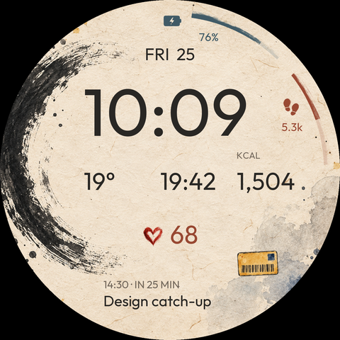
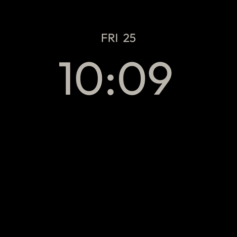

# Modular Lab · Ink & Paper

A reproducible Pixel Watch face with original painted paper, ink and watercolor artwork. Built with Google's **Watch Face Format 2**: Android renders the XML and raster assets, with no app service or runtime code.

 

These are layout previews using **sample data**, not watch screenshots. [Open the local preview](docs/preview.html) for active, ambient, zero, above-goal and missing-provider states. Version 0.4 uses two **36° painted arcs** at the top-right: battery and steps, with matching small icons and readings. Their outer extent stays 13 design units inside the circular display. The lower-left ink painting stays clear, and the heart reading is centered below the three-column data row. Earlier layouts remain in Git history.

## Fast edit / test loop

From the repository root on this Windows PC:

```powershell
# After editing tools/generate_face.py:
python tools/generate_face.py
python tools/validate.py
adb devices -l
python tools/build_apk.py --install --serial adb-59291WRCVL10MD-FinEdK._adb-tls-connect._tcp
```

The mDNS name above is the watch connection used during development. **Always copy the current serial from `adb devices -l`.** The IP and wireless connection port can change. A stale address such as `192.168.1.42:43389` will not work when ADB lists a different address or mDNS name. The installer checks the connection before building and prints the available targets instead of a traceback.

The APK is `build/fast/modular-lab-debug.apk`. The SDK-only builder uses AAPT2, zipalign and apksigner with your normal local Android debug key. It requires Python 3.10+, JDK 17+, Android platform 36 and Build Tools 36.0.0; it needs no Python dependencies or Maven downloads. These tools were present on this PC. If needed, set `ANDROID_HOME` to the SDK directory.

After installation, long-press the watch face → **Add watch face → Modular Lab**. Updates use `install -r`; if the selected face does not refresh, switch to another face and back. Unlock the watch to see the result. **Upgrading the first prototype:** use Edit → Complications to assign Calories, a custom center-left provider, Heart rate, Next event and your card app. This watch's runtime retains assignments by slot order even after XML slot IDs change. Version 0.4 preserves that order; an old Steps selection becomes the custom center-left slot, so change it to weather or another provider if desired.

## What is on the dial

| Area | Data / action |
|---|---|
| Top | Weekday and day; tap to open Calendar |
| Large digits | Digital time following the device's 12/24-hour setting |
| Battery | Blue top arc, small percentage beside it and painted battery icon on its left; tap for battery status |
| Steps | Terracotta upper-right arc and footprints; full at 10,000 steps, count continues above the goal; tap to open Fitbit |
| Center left / middle | Two large unlabeled custom complications, such as temperature and sunset; no tracks or bars |
| Center right | Large calorie count with a small KCAL label |
| Pulse | Fitbit heart rate and a gently beating painted heart |
| Bottom | Calendar next-event time/title; tap for the provider's event action |
| Painted card | Editable app shortcut; Google Wallet by default |

Long-press → **Edit → Complications** to change any of the six editable slots. Select **Center middle · Custom complication** to assign the new second custom slot; it starts blank. For the painted card, select **App shortcut**, then your supermarket-card app, or select that app's own complication. The artwork stays card-shaped; the selected provider owns the tap action. Apps without a complication can normally be selected through the system App shortcut provider.

Calorie and heart-rate defaults use the Fitbit services discovered on the Pixel Watch 4, with legacy provider fallbacks. Those component names are implementation details and may change after a Fitbit update; use the complication picker if a default stops working. On first use, open Fitbit and complete its setup/permissions. Missing data shows a placeholder or stays blank if Wear OS suppresses an unconfigured/locked slot; readings are never fabricated. Both custom slots default to empty for new instances and accept text, numeric and image complications. Existing instances retain their saved providers.

Steps uses WFF's built-in daily `STEP_COUNT`. Only the bar is capped at 10,000. The counter displays whole numbers below 1,000 and one decimal in thousands from 1,000: 1,213 → `1.2k`, 12,500 → `12.5k` (the watch's locale may use a decimal comma). Battery uses the actual device percentage. The heartbeat is a **decorative animation**, not synchronized to individual sensor beats. Fitbit controls the displayed heart-rate measurement and refresh rate.

Always-on mode uses a black background with only subdued time/date. Painting, health data and animation are hidden in ambient mode.

## Preview and reproduce the artwork

```powershell
python -m pip install -r requirements-dev.txt
python tools/render_preview.py
Start-Process .\docs\preview.html
```

Preview rendering also prepares the Android artwork from the original PNGs. All paintings, transparency, exact generation prompts and checksums are stored in [assets/artwork](assets/artwork/README.md). Rebuilding uses the saved source images; it does not invoke AI. Prompting an image model again is not pixel-deterministic.

Edit [tools/generate_face.py](tools/generate_face.py) for layout and data bindings, then regenerate the committed [WFF XML](watchface/src/main/res/raw/watchface.xml). The canvas is 480 × 480 design units and scales to the actual display. [tools/render_preview.py](tools/render_preview.py) reads that XML with fixed fixture data and the bundled Outfit font. It checks all 1,440 clock strings for width. Baselines, animation, provider refresh, editing and taps must still be checked on Wear OS.

## Connect the watch over Wi-Fi

1. Put the PC and watch on the same reachable Wi-Fi network.
2. Enable Developer options by tapping **Settings → System → About → Versions → Build number** seven times (wording varies).
3. Enable **ADB debugging** and **Wireless debugging** under Developer options.
4. Select **Pair new device**. Run `adb pair WATCH_IP:PAIRING_PORT` and enter the code from the watch.
5. Return to the main Wireless debugging screen. Run `adb connect WATCH_IP:CONNECTION_PORT`; this is usually a different port.
6. Run `adb devices -l`, then pass exactly that serial to the install command.

If ADB lists both an IP and an mDNS name, they may represent the same physical watch. Use `--serial` to disambiguate. The installer refuses a target that does not identify as a watch. Pair once; reconnect when the address changes. Turn wireless debugging off after testing to reduce battery use.

## Test in a Wear OS emulator

1. Install [Android Studio](https://developer.android.com/studio) and open this repository.
2. In SDK Manager, install platform **36**, Build Tools **36.0.0**, Platform Tools and Android Emulator.
3. In Device Manager, create a **Wear OS round** device with a Wear OS 6 / API 36 image, or a newer Wear OS image. Choose your host CPU architecture and enable virtualization. Start it and finish setup.
4. Run `adb devices -l`, then:

   ```powershell
   python tools/build_apk.py --install --serial emulator-5554
   ```

5. Long-press the emulator's face → **Add watch face → Modular Lab**. Test editing, 12/24-hour format and Always-on screen. Try both small and large round profiles.

Fitbit, Calendar and Wallet may be absent on the emulator. Use available complications there and test the actual providers on the watch. A normal Android App run configuration cannot launch this face: it has no Activity. Use these install commands or Android Studio's Wear OS Watch Face configuration if offered.

## Capture and validate

```powershell
python tools/capture.py --serial adb-59291WRCVL10MD-FinEdK._adb-tls-connect._tcp
python tools/check_apk.py build/fast/modular-lab-debug.apk
```

Captures go into ignored `captures/` and can contain private health/calendar data. The Python capture helper handles binary PNG output correctly on Windows PowerShell 5.

[Validation notes](docs/validation.md) distinguish checks already completed from hardware checks still needed. Google's validator checks XML structure; a passing validator alone does not prove runtime correctness or battery life.

## Gradle and GitHub builds

Pinned toolchain: Gradle **9.3.1**, AGP **9.0.0**, compile/target SDK **36**, Build Tools **36.0.0**, WFF **2**, minimum API **34 / Wear OS 5**. WFF is Google's supported declarative watch-face framework and fits this resource-only design without Compose or Flutter.

```powershell
.\gradlew.bat :watchface:assembleDebug :watchface:lintDebug
# watchface/build/outputs/apk/debug/watchface-debug.apk
```

On macOS/Linux use `./gradlew`. The wrapper verifies the Gradle distribution checksum. First use needs Maven access; the fast SDK-only path avoids those downloads. Resource shrinking is disabled because WFF references assets inside raw XML; code shrinking removes AGP's generated resource bytecode.

GitHub Actions regenerates XML/images, compares their contents, validates WFF, runs Gradle build/lint, builds via the SDK-only path and verifies both APKs. Download them from **Actions → Build watch face → successful run → Artifacts**. Debug keys are local and untracked: CI and your PC may sign differently. Use the same signing key for updates. Uninstalling to resolve a certificate mismatch clears this face's settings.

## Sources and licenses

- [Watch Face Format](https://developer.android.com/training/wearables/wff), [setup](https://developer.android.com/training/wearables/wff/setup), and [default providers](https://developer.android.com/reference/wear-os/wff/complication/default-provider-policy).
- [Google's WFF samples](https://github.com/android/wear-os-samples/tree/main/WatchFaceFormat) and [validator/specification](https://github.com/google/watchface/tree/main/third_party/wff).
- [Wireless debugging](https://developer.android.com/training/wearables/get-started/debug-wifi) and [Wear OS emulator/debugging](https://developer.android.com/training/wearables/get-started/debugging).

The first prototype independently recreated Google's Modular arrangement; no public source for the shipping face was found. This painted version is an original design inspired by the user's reference, with no commercial face assets redistributed. Code/artwork are Apache-2.0 where applicable; Outfit is SIL OFL 1.1. See [THIRD_PARTY_NOTICES.md](THIRD_PARTY_NOTICES.md).
